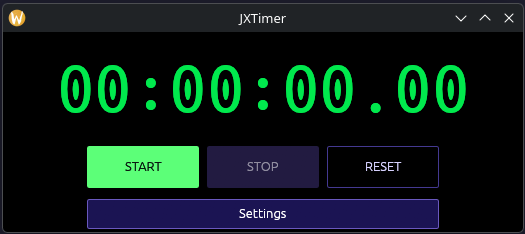
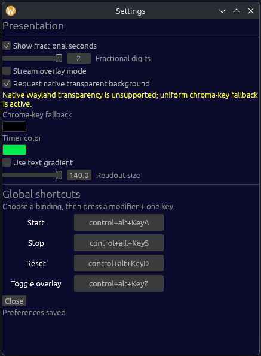

# JXTimer

A compact native desktop timer for stream overlays.

## Screenshots

<!--
Add screenshots here when available. GitHub supports these relative paths:



-->

## Features

- Start, stop, and reset controls with configurable global shortcuts.
- Compact stream overlay with configurable chroma-key background, timer colors, and gradient angle.
- Persisted appearance and shortcut preferences.

## Run

Install [Rust](https://www.rust-lang.org/tools/install), then run:

```sh
cargo run
```

Build an optimized binary with:

```sh
cargo build --release
```

## License

MIT
